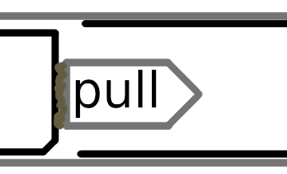
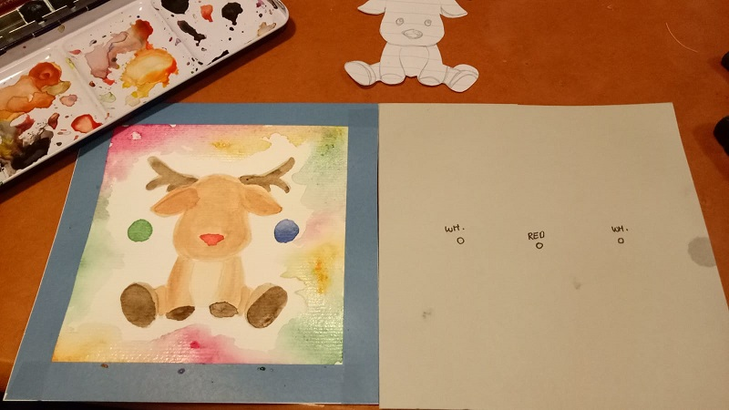
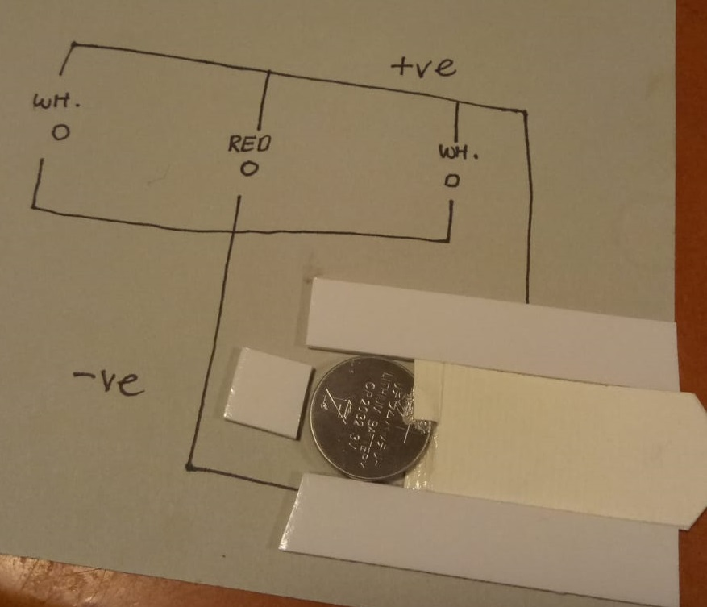
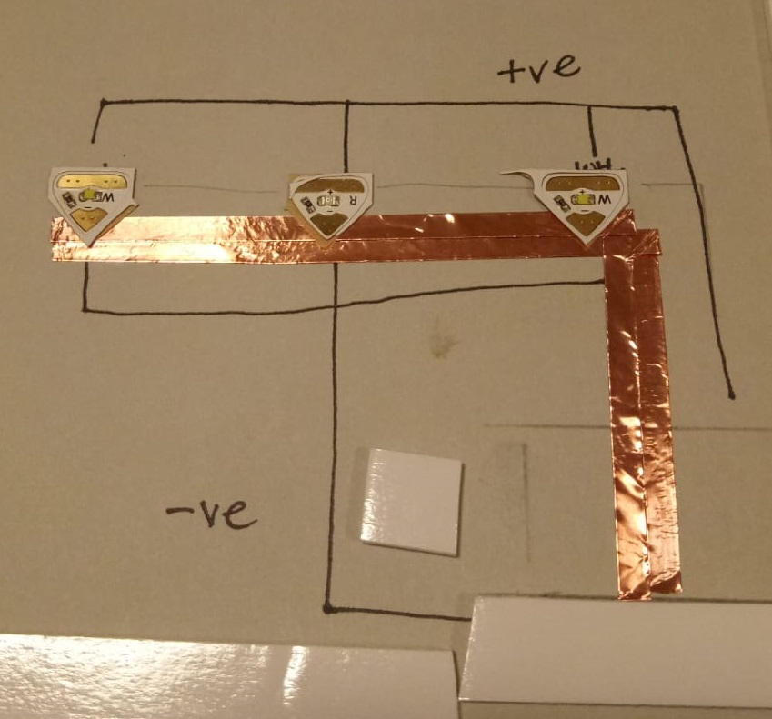
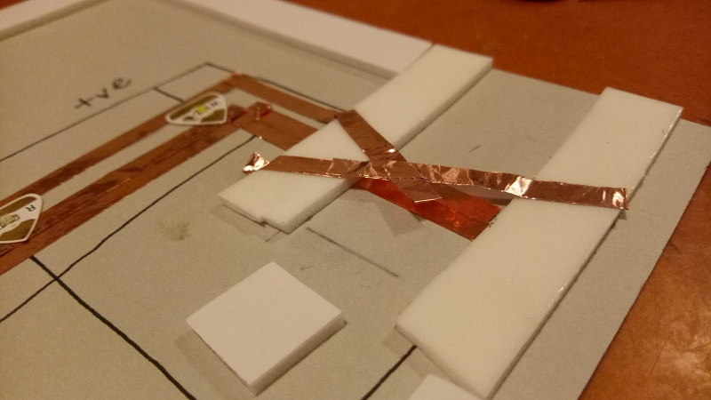
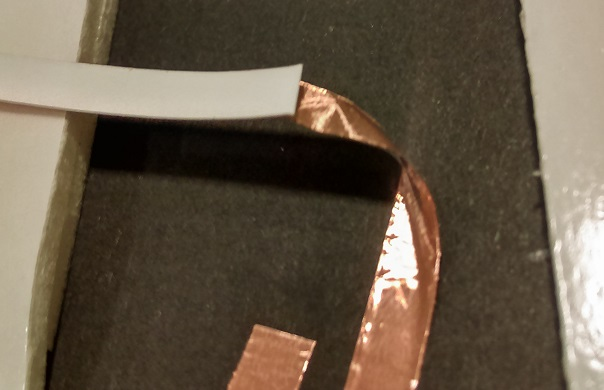
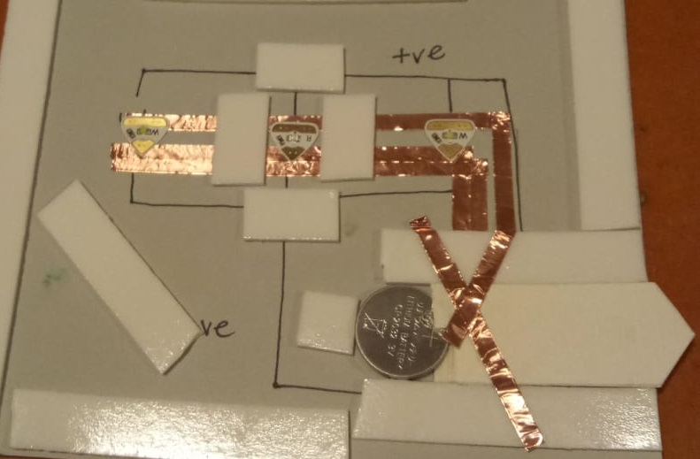
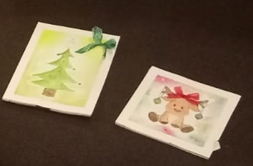

# Chibi Cards

Surprise your friends and family with these creative Christmas cards! Use the LED starter kit from Chibitronics to provide a small circuit so you can entertain the young and old alike with a thoughtful Christmas greeting. Perfect with kids. Makes 6 cards.	

## Bill of Materials

| Qty | Code | Description | 
| --- |  --- | ----|
|1| [KJ9330](http://jaycar.com.au/p/KJ9330) | Chibitronics Circuit maker kit |
|4| [SB2522](http://jaycar.com.au/p/SB2522) | Spare coin-cell batteries |
| | | Some double-sided tape, glue, cardboard |
| | | and a willingness to be creative | 

## Assembly

There's many different styles of "mechanisms" you can use in the chibi-tronics kit. one style is to use a 'press button' style, but we thought we'd make something a little more interesting with a "pull-out" style tab which activates the circuit.

The basic idea is you pull a tab that is glued onto a battery, which, once it is pulled into the right spot, it makes contact with both an upper and a lower copper strip, which completes the circuit and lights up the lights.

#### Step 1: Find where you want the LEDs.

Make a panel the same size as your card, and paint on it the basics of your artwork. We've found that watercolour works best, but you can use almost any kind of paint, as the LED's are pretty bright.
Use this to mark out where abouts you'd want the LED lights. you can see in the left hand side of the image above, we've marked out 3 spots and what colours we want them.

#### Step 2: Design the battery cage

Here we've started to draw the circuit of what we're going to be doing, with the negative side going under the battery cage, and the positive side is going to sit on the top side, attached to our artwork.

We've also cut out and glued a small tab to the battery so that we can pull it. Be careful not to cover the top or bottom of the battery, as we need those to make contact!

#### Step 3: Lay down the negative copper side

Now we're starting to build the circuit. Remember that you want a bit of of a gap between the back of the battery-cage, so that the battery will be disconnected from the circuit when the battery tab is pushed all the way in. We've also found that somtimes a doublely wide connection works better, so we've doubled up and made it a thicker amount of copper, but you can experiment.

We've also positioned the lights so you can see where the lights will stick onto once we've done.

#### Step 4: Lay down the positive side, with the inverted bend.

Now we're making the cage that the battery slides into. Be sure to turn the copper around so that the glued side will be facing 'upwards' and attach onto the front card. You can do that by using an inverted bend, as shown below:

#### Step 5: Place lights and test the circuit

Now we're finishing up our little engineering project by doing the final testing before sticking everything down.
Place on the LED lights where you've marked them to go, making sure that the positive and negative are connecting to the right copper strips, and put the battery in to test if the circuit works. 

If the circuit doesn't work properly, make sure that everything is pressed down firmly, and possibly flip the battery around to see if you've got the polarity right.

Now you can start to form some barriers to block the light a bit. You can see we've used some double-sided tape to block in where the red LED goes, so that the red light doesn't swamp out the other lights on the baubles.

#### Step 6: Place your artwork on the top.

Now the final test is with the artwork ontop, you can makesure that the LED's light up where they need to, and check for any further tape you might have to put in. More tape makes for a sturdier card.

Once you're satisfied, remove the backing to the tape (and the copper!) and stick to your artwork.

Thats it, you're finished! Be sure to share your creations on our facebook page to show off your creative and artistic skills!

